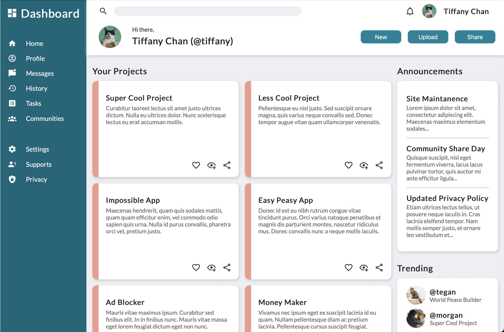

# The Odin Project - Project: Admin Dashboard

## Description
A responsive admin dashboard written in HTML and CSS for the admin dashboard project in [The Odin Project](https://www.theodinproject.com/).
This page is responsive but optimized for desktop only. It will be updated to be responsive in all devices after I learn media query.
The purpose of this project is to practice making a admin dashboard template page with CSS Grid. You can also try the project yourself [here](https://www.theodinproject.com/lessons/node-path-intermediate-html-and-css-admin-dashboard)!

## Project Preview
### Screenshot

### Preview
You can also preview the page [here](https://tiffanychan614.github.io/odin-admin-dashboard/)

## Skills
- Basic HTML
- Baisc CSS
- CSS Grid

## What I Learned in this Project
- To make nested grids
- To use fractional unit (fr)
- To make the page responsive using the formula (`[num]rem + [num]vw/vh`)
- CSS selectors
- To use CSS functions (calc(), minmax(), clamp())
- To use CSS variables
- To use sizing keyword max-content
- To use rem instead of px to improve responsiveness and accessbility
- To use transition and transform to create simple animated effects
- To make elements sticky inside a grid

## Things to Improve / Add
- To optimize for mobile devices

## Credits
### Images and Fonts
- Google Font: https://fonts.google.com
- Material Design Icons: https://materialdesignicons.com
- Unsplash: https://unsplash.com/
- Manja Vitolic: https://unsplash.com/@madhatterzone
- Alexander London: https://unsplash.com/@alxndr_london
- Raoul Drogg: https://unsplash.com/@raouldroog
- Amber Kipp: https://unsplash.com/@sadmax

### Project Ideas
- IlyaEru: https://ilyaeru.github.io/TOP-Project-Admin-Dashboard/
